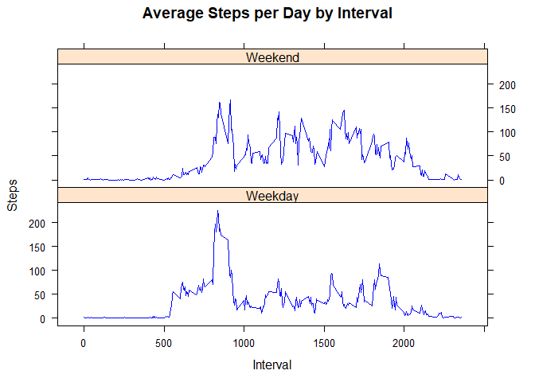

Loading and preprocessing the data
----------------------------------

1.  Load the data (i.e. read.csv())
2.  Process/transform the data (if necessary) into a format suitable for your analysis

``` r
# Import data
data <- read.csv("activity.csv")
```

What is mean total number of steps taken per day?
-------------------------------------------------

For this part of the assignment, you can ignore the missing values in the dataset.

1.  Make a histogram of the total number of steps taken each day.

-   Please refer to the generated histogram below:

``` r
dailySteps <- aggregate(steps ~ date, data, sum)
hist(dailySteps$steps, main = paste("Total Steps Each Day"), col="green", xlab="Number of Steps")
```


1.  Calculate and report the mean and median total number of steps taken per day.

-   Please refer to the results below:

``` r
rmean <- mean(dailySteps$steps)
rmedian <- median(dailySteps$steps)
rmean
```

    ## [1] 10766.19

``` r
rmedian
```

    ## [1] 10765

What is the average daily activity pattern?
-------------------------------------------

1.  Make a time series plot (i.e. type = "l") of the 5-minute interval (x-axis) and the average number of steps taken, averaged across all days (y-axis).

-   Please refer to the time-series plot below:

``` r
stepsInterval <- aggregate(steps ~ interval, data, mean)
plot(stepsInterval$interval,stepsInterval$steps, type="l", xlab="Interval", ylab="Number of Steps",main="Average Number of Steps per Day by Interval", col="blue")
```


1.  Which 5-minute interval, on average across all the days in the dataset, contains the maximum number of steps?

-   Please refer to the result below

``` r
maxInterval <- stepsInterval[which.max(stepsInterval$steps),1]
maxInterval
```

    ## [1] 835

Imputing missing values
-----------------------

Note that there are a number of days/intervals where there are missing values (coded as NA). The presence of missing days may introduce bias into some calculations or summaries of the data.

1.  Calculate and report the total number of missing values in the dataset (i.e. the total number of rows with NAs).

-   Please refer to the total number of rows with NAs or missing values.

``` r
inc <- sum(!complete.cases(data))
inc
```

    ## [1] 2304

1.  Devise a strategy for filling in all of the missing values in the dataset. The strategy does not need to be sophisticated. For example, you could use the mean/median for that day, or the mean for that 5-minute interval, etc.

2.  Create a new dataset that is equal to the original dataset but with the missing data filled in.

-   Please refer to the answer below: (Missing values were imputed by inserting the average for each interval.):

``` r
imputedData <- transform(data, steps = ifelse(is.na(data$steps), stepsInterval$steps[match(data$interval, stepsInterval$interval)], data$steps))
imputedData[as.character(imputedData$date) == "2012-10-01", 1] <- 0
```

-   Recount total steps by day

``` r
dailySteps_i <- aggregate(steps ~ date, imputedData, sum)
```

1.  Make a histogram of the total number of steps taken each day and Calculate and report the mean and median total number of steps taken per day. Do these values differ from the estimates from the first part of the assignment? What is the impact of imputing missing data on the estimates of the total daily number of steps?

-   Please refer to the results below with combined histogram:

``` r
hist(dailySteps_i$steps, main = paste("Total Steps Each Day"), col="blue", xlab="Number of Steps")
hist(dailySteps$steps, main = paste("Total Steps Each Day"), col="green", xlab="Number of Steps", add=T) 

legend("topright", c("Imputed", "Non-imputed"), col=c("blue", "green"), lwd=10)
```


``` r
i_rmean <- mean(dailySteps_i$steps)
i_rmedian <- median(dailySteps_i$steps)
i_rmean
```

    ## [1] 10589.69

``` r
i_rmedian
```

    ## [1] 10766.19

``` r
d_mean <- i_rmean - rmean
d_median <- i_rmedian - rmedian
d_mean
```

    ## [1] -176.4949

``` r
d_median
```

    ## [1] 1.188679

-   non-imputed mean is 10766.19 while imputed-mean is 10589.69
-   the difference in mean is -176.4949
-   non-imputed median is 10765 while imputed median is 10766.19
-   the difference in median is 1.188679
-   the impact of imputed-data is that there were 7.5363 × 104 more steps in the imputed data.

Are there differences in activity patterns between weekdays and weekends?
-------------------------------------------------------------------------

For this part the weekdays() function may be of some help here. Use the dataset with the filled-in missing values for this part.

1.  Create a new factor variable in the dataset with two levels -- "weekday" and "weekend" indicating whether a given date is a weekday or weekend day.

-   Please refer to the code below:

``` r
weekdays <- c("Monday", "Tuesday", "Wednesday", "Thursday", 
              "Friday")
imputedData$dow = as.factor(ifelse(is.element(weekdays(as.Date(imputedData$date)),weekdays), "Weekday", "Weekend"))

stepsInterval_i <- aggregate(steps ~ interval + dow, imputedData, mean)
```

1.  Make a panel plot containing a time series plot (i.e. type = "l") of the 5-minute interval (x-axis) and the average number of steps taken, averaged across all weekday days or weekend days (y-axis).

-   Please refer to the code and panel plot below:

``` r
library(lattice)

xyplot(stepsInterval_i$steps ~ stepsInterval_i$interval|stepsInterval_i$dow, main="Average Steps per Day by Interval",xlab="Interval", ylab="Steps",layout=c(1,2), type="l",par.settings=simpleTheme(col="blue"))
```


